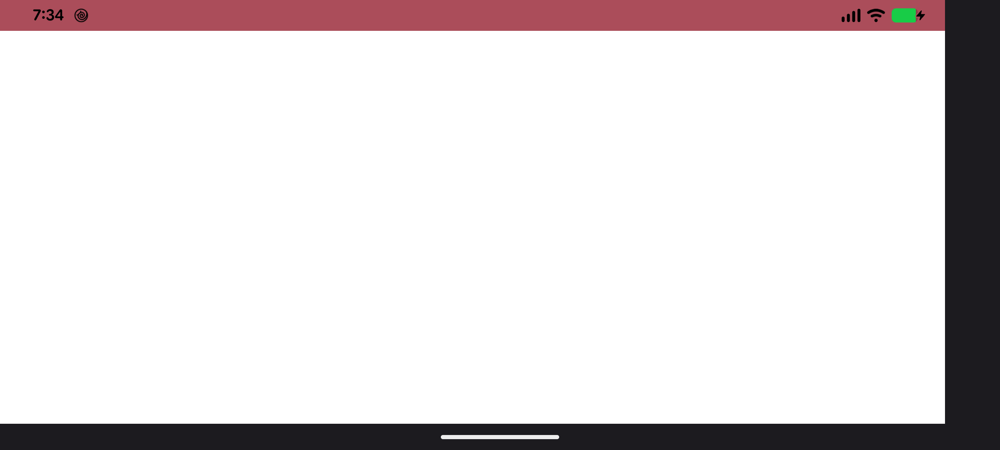
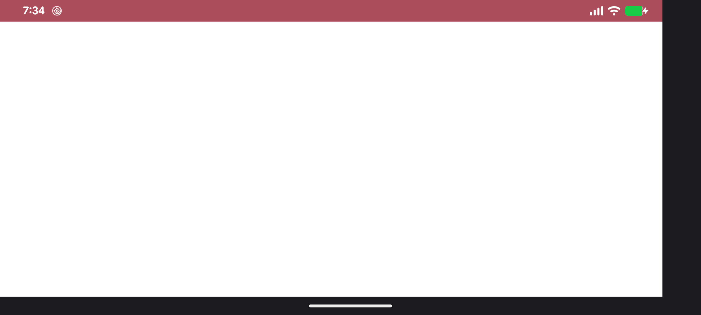

# Expanded Dark Theme Issue on Pixel Devices

## Conditions
- A real Pixel device (doesn't reproduce in emulator)
- Android 17 up to QPR1 Beta5
- In the Settings app, turn on Dark theme and its Expanded option
- App's main screen below the status bar is white; it does not occur if the background is black.

## Issue Description
When I rotate the device from portrait to landscape 90 degrees clockwise,
the status bar icons become black most of the time even though there is  a view
with dark background below the status bar. 
Then those icons turn white when the system updates the status bar next time.
For example when updating the clock, or if I swipe down from the top of the screen slightly
then release the finger.

When the app is launched in portrait mode, the icons are always white. The status bar icon colors should be consistent regardless of the screen orientation,
and should only depend on the color under the status bar, not the main app screen.

Properties in styles.xml do not affect the behavior. In fact, the XML file did not exist initially
and the issue occurred regardless.

## About this program
You can change the background color of the main app screen by tapping anywhere in the app.
The background color changes between white and black. 
Then you can confirm the different behaviors depending on the background color of the app:
- Black background before rotation will turn the icons to white after rotation.
- White background before rotation will turn the icons to black after rotation.

The layout is taken from a real production app that supports Android 7+ to demonstrate the problem.

## Screenshots
Black icons right after rotating the device:

White icons after refreshing the status bar by swiping from top then release the finger:

I have not done anything programmatically in order to change the icon colors. 
OS updates them dynamically.

## Videos

 First video.

 This one demonstrates the issue more clearly. I just kept tapping the screen to change the app background color, then the status bar icon color kept changing as well in landscape mode.

## Ticket
https://issuetracker.google.com/issues/509581472
